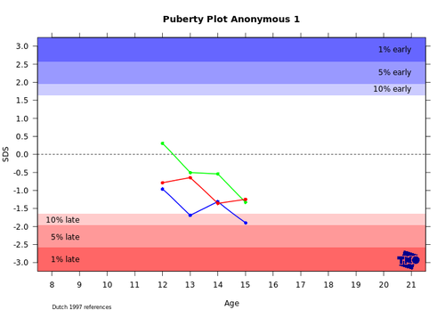

<!-- 
library(slidify)
library(slidifyLibraries)
-->

<!-- 
- fundamental change in the way analysis and vizualization methods get implemented 
- central: observation that field is rapidly changing
- traditions based on history. Old field, this works, rise of internet has gone unnoticed.
-->


## Definition

### Statistical Software as we know it:

 - Emphasis on UI
 - Interactive
 - Local machine
 - Single-user
 - Trial-and-error
 - Copy/paste results
 - Inventive, experimental, volatile

---

<!-- 
- still useful, but also need for:
- shift to, more emphasis on
- not black and white, different emphasis
-->

## Definition

### Embedded Scientific Computing


 - Statistical methods as modules
 - Applications, pipelines
 - Integration
 - Interoperability
 - Interdisciplinary
 - UI > API
 - Component Based Engineering
 - Separation of Concerns
 - Scaling

---

## Increasing Need for Interoperability

<!-- 
- Statistics and statisticians becoming more accessible is accompanied by interoperability of statistical software.
-->


  - Integrate with upcoming technology 
  - Big data, vizualization
  - Specialized applications
  - Real-time analysis on live data
  - Internet based data management
  - Web based scientific collaboration
  - Online analysis and pipelines
  - Transparency and reproducibility
  - Learning and teaching 

---

<!-- 
- ggplot2 gui got lots of attention, still mailing about that
-->

## Motivation

### How it started

[](http://vps.stefvanbuuren.nl/puberty "Link")

- Basic R webapps in 2008/2009
- Simple but very effective 
- Did some more applictions
- Lots of interest
- Bunch of consluting
- GSR for Mobilize
- ...

---

<!-- 
- anecdote: ggplot2 webapp server crash
- anecdote: lme4 server keeps getting stuck
- anecdote: very hard to train people to do this
Want to turn academic software into production software
-->

## Motivation

### Problems

- Unstable (lme4)
- Dependency problems (ggplot2)
- High coupling
- Unsustainable complexity
- Collaboration difficult
- Interdisciplinary disconnect
- Conclusion: doesn't scale
- Fundamental unsolved problems

---

<!-- 
- This is actually very difficult.
- Needs more research
- problems are underteremined, and complexity is underestimated
- What are application specific annoyances, and what are core problems?
-->


## Research Goal

### Integrated Statistical Software that is:

 - Reliable
 - Scalable
 - Practical

### To do so:

- Find recurring struggles
- Distill fundamental problems
- Identify core logic
- Experiment with solutions

---

## Approach: OpenCPU


- Develop general purpose software system
- Solve 'hard' problems, and nothing else
- Simple, flexible, extensible
- Language/application agnostic
- Iterative development through trial and error
- Software itself is subject of study
- Pragmatic solutions
- Proof of concept implementation

---

## Research: Four cornerstones


### Core problems:

> 1. Interoperable Interfacing
> 2. Security and resource control
> 3. Data Interchange
> 4. Dependency Versioning

### For each topic:

> - Identify and delineate problem
> - Domain specific aspects
> - Approaches
> - My solution

---

## Research: Four cornerstones


### Core problems:

 1. Interoperable Interfacing
 2. <b>Security and resource control</b>
 3. <b>Data Interchange</b>
 4. <b>Dependency Versioning</b>

### For each topic:

 - Identify and delineate problem
 - Domain specific aspects
 - Approaches
 - My solution

---

## Research: Four cornerstones


### Core problems:

 1. <b>Interoperable Interfacing</b>
 2. Security and resource control
 3. Data Interchange
 4. Dependency Versioning

### For each topic:

 - Identify and delineate problem
 - Domain specific aspects
 - Approaches
 - My solution

---

## About R


 - Mature, reliable, flexible
 - Lingua franca, de-facto standard
 - Experiences mostly with R
 - Problems and solutions illustrated in R

### However

 - Purpose is not merely to develop software
 - Thesis describes general logic of computing
 - Same problems will appear in other languages
 - Similar techniques will work for Matlab, Julia, Python
 - But to study the software, we need an implementation
 

---

## Part 1: Security and Resource Control


---

## Security and resource control

- Most challenging piece
- Problem: access control
- Restrict execution environment
- Prevent malicious use
- Control hardware resources
- Critical aspect of scalability

---

## User-role security model


### Traditional approach

- Define users and privileges
- Assign privileges per user
- Require privileges for each possible action.
- Only allow a limited set of actions
- Implement all predefined in application layer

### Problematic for statistics

- Limited use for prescripted actions
- Users want access to full language lexicon
- User-role systems explode in complexity
- Does not solve resource control problem

---

## Alternative: Mandatory Access Control


- Enforce security policies by process
- No users or user roles
- More flexibility
- Available in Linux, BSD (relatively recent)

### AppArmor

- AppArmor: security module in Linux kernel
- Restrict file-system, capabilities, signals, network traffic, etc
- Policies defined in a 'profile'
- Apply profile to any process

---

## Example security profile

```no-highlight
profile r-base {
    #include <abstractions/base>
    #include <abstractions/nameservice>
    @{PROC}/[0-9]*/attr/current r,    

    /bin/* rix,
    /etc/R/* r,
    /etc/fonts/** mr,
    /etc/resolv.conf r,
    /tmp/** rw,
    /usr/bin/* rix,
    /usr/lib/R/bin/* rix,
    /usr/lib{,32,64}/** mr,
    /usr/lib{,32,64}/R/bin/exec/R rix,
    /usr/local/lib/R/** mr,
    /usr/local/share/** mr,
}
```

---

## Mandatory Access Control

RAppArmor: bindings security methods in `Linux`:

```{r eval=FALSE}
#Set 100M memory limit
> rlimit_as(100 * 1024 * 1024)

#Set 4 core limit
> rlimit_nproc(4)

#apply security profile
> aa_change_profile("my_secure_profile")

#not allowed
> list.files("/")
character(0)
```

---

## Dynamic Sanboxing with eval.secure

```{r eval=FALSE, tidy=FALSE}
#Sandboxed evaluation
> eval.secure({
  #arbitrary code
  x <- rnorm(3)
  mean(x)
#With restrictions  
}, profile="my_secure_profile", rlimit_as = 100 * 1024 * 1024, rlimit_nproc = 4)
[1] 0.01563452
```

Dynamic sandboxing with `eval.secure`:

 1. Create fork of the current process
 2. Apply limits and security profile
 3. Evaluate code in fork
 4. Copy output to parent proc
 5. Kill fork (and children)

---

## Mandatory Access Control

### Major benefits for scientific computing

 - No need for complex user-role security policies
 - Separate security concern from computing concerns
 - Support for arbitrary code execution
 - Fine grained control over hardware allocation
 - Scale up to many users without sacrifing reliability
 - Performance overhead neglectible  

---

## Part 2: Data Interchange


---

## Data Interchange

### The problem

 - Various formats: `CSV`, `JSON`, `XML`, `Protocol Buffers`, etc
 - Challenge: defining interface structure
 - Schemas? Documentation?

### Solution: direct mapping

- Direct a mapping between `JSON` data and important R classes
- Simple, yet effective.
- More natural for dynamic typed languages

---

## Examples of JSON <--> R

```{r echo=FALSE}
library(jsonlite)
```

```{r eval=FALSE}
#Random object
x <- list(foo = matrix(1:8, nrow=2))

#Convert to JSON
json <- toJSON(x)
cat(json)
{ "foo" : [ [ 1, 3, 5, 7 ], [ 2, 4, 6, 8 ] ] }

#Convert back to R
y <- fromJSON(json)
all.equal(x,y)
[1] TRUE
> print(y)
$foo
     [,1] [,2] [,3] [,4]
[1,]    1    3    5    7
[2,]    2    4    6    8
```

---

## Examples of JSON <--> R

```{r eval=FALSE, tidy=FALSE}
> toJSON(iris[1:2,], pretty=T)
[
  {
		"Sepal.Length" : 5.1,
		"Sepal.Width" : 3.5,
		"Petal.Length" : 1.4,
		"Petal.Width" : 0.2,
		"Species" : "setosa"
	},
	{
		"Sepal.Length" : 4.9,
		"Sepal.Width" : 3,
		"Petal.Length" : 1.4,
		"Petal.Width" : 0.2,
		"Species" : "setosa"
	}
]
```

---

## Limitations

```{r eval=FALSE}
#matrix
> identical(volcano, fromJSON(toJSON(volcano)))
[1] TRUE

#data frame
> identical(cars, fromJSON(toJSON(cars)))
[1] TRUE

#factors are coersed to strings
> json <- toJSON(iris)
> iris2 <- fromJSON(json)
> all.equal(iris, iris2)
   Component “Species”: 'current' is not a factor
> iris2$Species <- as.factor(iris2$Species)
> all.equal(iris, iris2)
[1] TRUE
```

---

## Part 3: Dependency Management


---

## What is a dependency?

```no-highlight
Package: dplyr
Type: Package
Title: dplyr: a grammar of data manipulation
Version: 0.1.1
Author: Hadley Wickham <h.wickham@gmail.com>, Romain Francois <romain@r-enthusiasts.com>
Maintainer: Hadley Wickham <h.wickham@gmail.com>
Description: A fast, consistent tool for working with data frame like objects, both in
  memory and out of memory.
URL: https://github.com/hadley/dplyr
Depends: R (>= 3.0.2)
Imports: assertthat, utils, methods, Rcpp
Suggests: hflights, RSQLite, RSQLite.extfuns, RMySQL, RPostgreSQL, data.table, 
  bigrquery, testthat, Lahman, knitr, microbenchmark, ggplot2, mgcv
```

---

## Depencency Types:

 - Dependencies between packages: `Depends`, `Imports`, `Suggests`, `Enhances`, `LinkingTo`.
 - R, Sweave, knitr script depends on package: `library(ggplot2)`
 - System/application embedded R functionality.

## Dependency Relations

 - Depends
 - Reverse Depends
 - Dependency Network (directed graph)
 - Indirect Dependencies (transitivity)

---

<!--
Unique: technical problem, but also a social problem
Reason for technical problem is cultural
-->

## Dependency Versioning


- Problem: versioning dependencies
- Current policies unsustainable
- Leads to unstable software
- Irreproducible results

### Challenges

- Cannot be solved downstream
- Requires community to modernizing practices
- I try to make a case for moving to a better dependency system 
- Turns out to be challenging :-)

---

## Interfacing

- Interoperable
- Separation of concerns
- HTTP
- State problem


---


## Apps

---

# Conclusion

> - Build applications
> - Collaborative
> - Hope to contribute to socializing data analysis