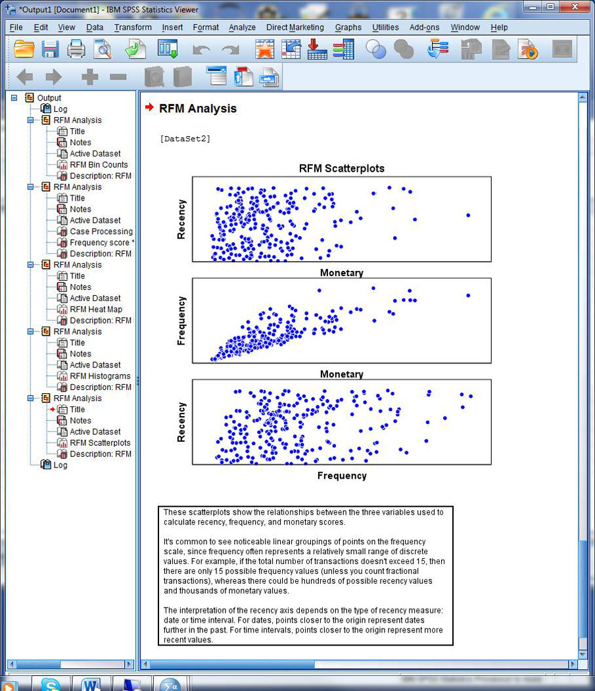
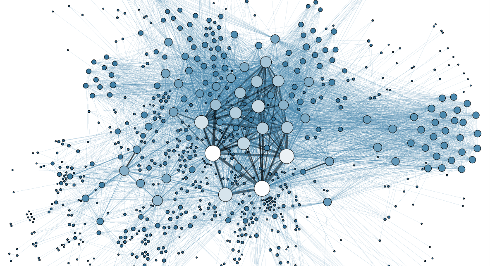
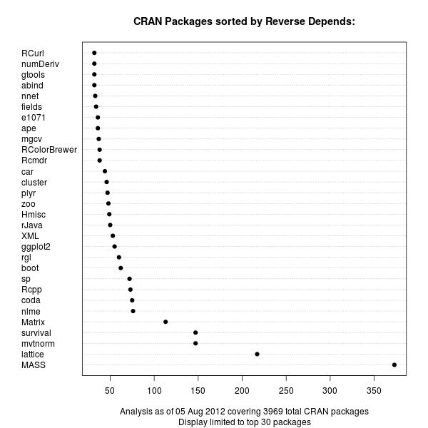
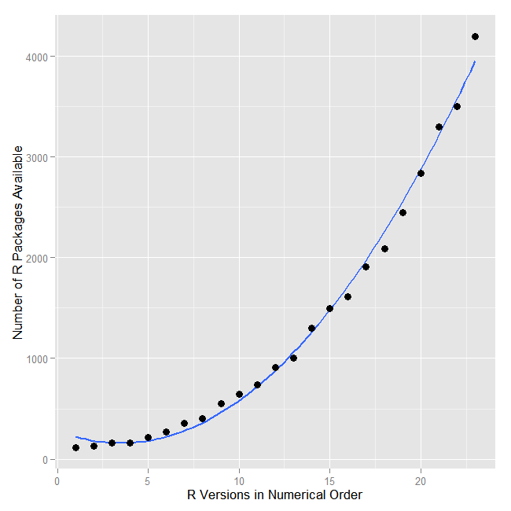
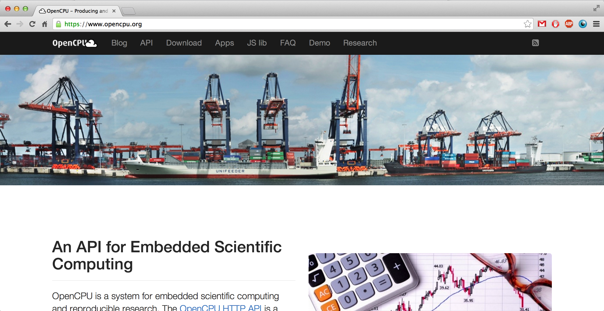

<!-- 
library(slidify)
library(slidifyLibraries)
-->

<!-- 
- fundamental change in the way analysis and vizualization methods get implemented 
- central: observation that field is rapidly changing
- traditions based on history. Old field, this works, rise of internet has gone unnoticed.
-->

## About Me

<!-- 
start out with ID, got fascinated with cognication and switched over to psych and ID,
turns out cognition is complex and messy, statistics more elegant
Came to UCLA statistics. Computational, home of JSS
Now find myself doing programming all day.
-->


 - PostDoc in Statistics at UCLA (2014)
 - Interdisciplinary! ID -> Psychology, AI (BSc) -> Methodology for Social Sciences (MSc) -> Statistics (PhD) -> Computing
 - Current research in embedded scientific computing
 - Author of the OpenCPU system
 - Maintainer of several R packages (jsonlite, RAppArmor)
 - Consultant in web development with R
 - Favorite Languages: R (data), JavaScript (gui, viz), C (fast)
 - Use a lot: HTTP, Linux, MongoDB 
 - Organiser of LA R user group, UseR! 2014
 - More: http://jeroenooms.github.io

---

## Statistical Software



### Where we come from:

 - SPSS, Excel, SAS, R
 - Emphasis on UI
 - Interactive
 - Local machine
 - Single-user
 - Trial-and-error
 - Copy/paste results
 - Inventive, experimental, volatile

---

<!-- 
- still useful, but also need for:
- shift to, more emphasis on
- not black and white, different emphasis
-->

## Where we are going


 - Statistical methods as modules
 - Applications, systems, pipelines
 - Integration
 - Interoperability
 - Interdisciplinary
 - UI > API
 - Component Based Engineering
 - Separation of Concerns

---

## Increasing Need for Interoperability

<!-- 
- Statistics and statisticians becoming more accessible is accompanied by interoperability of statistical software.
-->

### Current developments:

  - Integrate with upcoming technology 
  - Big data, vizualization
  - Specialized applications
  - Real time analysis and pipelines
  
### Near future

  - Internet based data management
  - Socializing data analysis
  - Domain specific applications
  - Transparency and reproducibility
  - Learning and teaching

---

## Challenges (1): Interfacing data

 - Data come in all shapes and sizes
 - No nice data structures or tables (SQL)
 - Content of data is unknown
 - Very hard to write robust code
 - No clear separation users and developers
 - Missing values
 - Numeric properties

---

## Challenges (2): Unpredictable behavior

 - Algorithms often non deterministic
 - Non-convergence, local optima
 - MCMC methods: completley random
 - Can lead to excessive use of resources (mem, cpu)
 - Need interactive error handling
 - Statistics is a lot of <strong>data debugging</strong>

---

## Challenges (3): Managing experimental software

 - Scientific computen often involves inventive, volatile software.
 - Written by academics / grad students
 - Software might not work out-of-the box on any data
 - Traditionally no notion of production in data analysis
 - Software is designed for interactive use
 - Dependency versioning not considered an issue.

---

## Conclusion

 - Not much overlap between statisticians and application developers
 - Simple cross language bindings are unreliable, unscalable
 - High coupling also makes development very difficult
 - Need separation of concerns between application and analysis 
 - Need for middle layer
 - Framework: API, Data IO, Resourcse, Scheduling, Auth, etc.

---

## Frameworks (1) Revolution DeployR

 - Developed by Revo, since 2009
 - Targets mostly BI tools
 - Integrates with other Revo products
 - Java Stack, wraps around Rserve.
 - XML/JSON APIs
 - Eval code and scripts
 - Repository to manage object, users, privileges, etc
 - More enterprisy stuff
 - Recently open sourced

---

## Frameworks (2) RStudio Shiny

 - Fun, write simple webapps in R
 - Reactive programming framework
 - Single R process per session
 - Free single-user server
 - Pro server for multiple users
 - Some enterprise features
 - Great for non web developers
 - Not very interoperable

---

## Shiny hello world


```r
library(shiny)

# Define server logic required to draw a histogram
shinyServer(function(input, output) {
  output$distPlot <- renderPlot({
    x    <- faithful[, 2]  # Old Faithful Geyser data
    bins <- seq(min(x), max(x), length.out = input$bins + 1)

    # draw the histogram with the specified number of bins
    hist(x, breaks = bins, col = 'darkgray', border = 'white')
  })
})
```

---

## Shiny hello world


```r
# Define UI for application that draws a histogram
shinyUI(fluidPage(
  titlePanel("Hello Shiny!"),

  # Sidebar with a slider input for the number of bins
  sidebarLayout(
    sidebarPanel(
      sliderInput("bins", "Number of bins:",
        min = 1, max = 50, value = 30)
    ),

    # Show a plot of the generated distribution
    mainPanel(
      plotOutput("distPlot")
    ))
))
```

---

## Frameworks: OpenCPU


- Develop general purpose software system
- Solve 'hard' problems, and nothing else
- Simple, flexible, extensible
- Language/application agnostic
- Iterative development through trial and error
- Software itself is subject of study
- Pragmatic solutions
- Proof of concept implementation

---

## Research: Four cornerstones


### Core problems:

> 1. Interoperable Interfacing
> 2. Security and resource control
> 3. Data Interchange
> 4. Dependency Versioning

### For each topic:

> - Identify and delineate problem
> - Domain specific aspects
> - Approaches
> - My solution

---

## Research: Four cornerstones


### Core problems:

 1. Interoperable Interfacing
 2. <b>Security and resource control</b>
 3. <b>Data Interchange</b>
 4. <b>Dependency Versioning</b>

### For each topic:

 - Identify and delineate problem
 - Domain specific aspects
 - Approaches
 - My solution

---

## Research: Four cornerstones


### Core problems:

 1. <b>Interoperable Interfacing</b>
 2. Security and resource control
 3. Data Interchange
 4. Dependency Versioning

### For each topic:

 - Identify and delineate problem
 - Domain specific aspects
 - Approaches
 - My solution

---

## About R


 - Mature, reliable, flexible
 - Lingua franca, de-facto standard
 - Big community
 - Experiences mostly with R
 - Problems and solutions illustrated in R

### However

 - Purpose is not merely to develop software
 - Thesis describes general logic of computing
 - Same problems will appear in other languages
 - Similar techniques will work for Matlab, Julia, Python
 - But to study the software, we need an implementation
 

---

## Part 1: Security and Resource Control


---

## Security and resource control

### The problem

- Most challenging piece
- UI > API transition
- Problem: access control
- Restrict execution environment
- Prevent malicious use
- Control hardware resources
- Critical aspect of scalability

---

## User-role security model


### Traditional approach

- Define users and privileges
- Assign privileges per user
- Require privileges for each possible action.
- Only allow a limited set of actions
- Implement all predefined in application layer
- RevoDeployR

### Problematic for statistics

- Limited use for prescripted actions
- Users want access to full language lexicon
- User-role systems explode in complexity
- Does not solve resource control problem

---

## Alternative: Mandatory Access Control


- Enforce security policies by process
- No users or user roles
- More flexibility
- Available in Linux, BSD (relatively recent)

### AppArmor

- AppArmor: security module in Linux kernel
- Restrict file-system, capabilities, signals, network traffic, etc
- Policies defined in a 'profile'
- Apply profile to any process

---

## Example security profile

```no-highlight
profile r-base {
    #include <abstractions/base>
    #include <abstractions/nameservice>
    @{PROC}/[0-9]*/attr/current r,    

    /bin/* rix,
    /etc/R/* r,
    /etc/fonts/** mr,
    /etc/resolv.conf r,
    /tmp/** rw,
    /usr/bin/* rix,
    /usr/lib/R/bin/* rix,
    /usr/lib{,32,64}/** mr,
    /usr/lib{,32,64}/R/bin/exec/R rix,
    /usr/local/lib/R/** mr,
    /usr/local/share/** mr,
}
```

---

## Mandatory Access Control

RAppArmor: bindings security methods in `Linux`:


```r
#Set 100M memory limit
> rlimit_as(100 * 1024 * 1024)

#Set 4 core limit
> rlimit_nproc(4)

#apply security profile
> aa_change_profile("my_secure_profile")

#not allowed
> list.files("/")
character(0)
```

---

## Dynamic Sanboxing with eval.secure


```r
#Sandboxed evaluation
> eval.secure({
  #arbitrary code
  x <- rnorm(3)
  mean(x)
#With restrictions  
}, profile="my_secure_profile", rlimit_as = 100 * 1024 * 1024, rlimit_nproc = 4)
[1] 0.01563452
```

Dynamic sandboxing with `eval.secure`:

 1. Create fork of the current process
 2. Apply limits and security profile
 3. Evaluate code in fork
 4. Copy output to parent proc
 5. Kill fork (and children)

---

## Mandatory Access Control

### Major benefits for scientific computing

 - No need for complex user-role security policies
 - Separate security concern from computing concerns
 - Support for arbitrary code execution
 - Fine grained control over hardware allocation
 - Scale up to many users without sacrificing reliability
 - Performance overhead negligible  

---

## Alternative: Docker

 - Lightweight Containers
 - Builds on Linux LXC, cgroups
 - Run process in temporary VM
 - Isolate file system, HW resources 
 - Create images, fork from images
 - Used by Shiny Server
 - Also used for reproducible research

---

## Part 2: Data Interchange


---

## Data Interchange

### The problem

 - Various formats: `CSV`, `JSON`, `XML`, `Protocol Buffers`, etc
 - Challenge: defining interface structure
 - Schemas? Documentation?

### Solution: direct mapping

- Direct a mapping between `JSON` data and important R classes
- Simple, yet effective.
- More natural for dynamic typed languages

---

## Examples of JSON <--> R


```r
#Random object
x <- list(foo = matrix(1:8, nrow=2))

#Convert to JSON
json <- toJSON(x)
cat(json)
{ "foo" : [ [ 1, 3, 5, 7 ], [ 2, 4, 6, 8 ] ] }

#Convert back to R
y <- fromJSON(json)
all.equal(x,y)
[1] TRUE
> print(y)
$foo
     [,1] [,2] [,3] [,4]
[1,]    1    3    5    7
[2,]    2    4    6    8
```

---

## Examples of JSON <--> R


```r
> toJSON(iris[1:2,], pretty=T)
[
  {
		"Sepal.Length" : 5.1,
		"Sepal.Width" : 3.5,
		"Petal.Length" : 1.4,
		"Petal.Width" : 0.2,
		"Species" : "setosa"
	},
	{
		"Sepal.Length" : 4.9,
		"Sepal.Width" : 3,
		"Petal.Length" : 1.4,
		"Petal.Width" : 0.2,
		"Species" : "setosa"
	}
]
```

---

## Limitations


```r
#matrix
> identical(volcano, fromJSON(toJSON(volcano)))
[1] TRUE

#data frame
> identical(cars, fromJSON(toJSON(cars)))
[1] TRUE

#factors are coersed to strings
> json <- toJSON(iris)
> iris2 <- fromJSON(json)
> all.equal(iris, iris2)
   Component “Species”: 'current' is not a factor
> iris2$Species <- as.factor(iris2$Species)
> all.equal(iris, iris2)
[1] TRUE
```

---

## Part 3: Dependency Management



---

## What is a dependency?

```no-highlight
Package: dplyr
Type: Package
Title: dplyr: a grammar of data manipulation
Version: 0.1.1
Author: Hadley Wickham <h.wickham@gmail.com>, Romain Francois <romain@r-enthusiasts.com>
Maintainer: Hadley Wickham <h.wickham@gmail.com>
Description: A fast, consistent tool for working with data frame like objects, both in
  memory and out of memory.
URL: https://github.com/hadley/dplyr
Depends: R (>= 3.0.2)
Imports: assertthat, utils, methods, Rcpp
Suggests: hflights, RSQLite, RSQLite.extfuns, RMySQL, RPostgreSQL, data.table, 
  bigrquery, testthat, Lahman, knitr, microbenchmark, ggplot2, mgcv
```

---

## Depencency Types:

 - Dependencies between packages: `Depends`, `Imports`, `Suggests`, `Enhances`, `LinkingTo`.
 - R, Sweave, knitr script depends on package: `library(ggplot2)`
 - System/application embedded R functionality.

## Dependency Relations

 - Depends
 - Reverse Depends
 - Dependency Network (directed graph)
 - Indirect Dependencies (transitivity)

---

## CRAN Policy

<q> For a package update, please check that any packages depending on this one still pass R CMD check: it is especially expected that you will have checked your own packages. A listing of the reverse dependencies of the current version can be found on the CRAN web page for the package.</q>

---

## Policy Implications



 - Package author responsible
 - Basically forbids any breaking changes / refactoring / cleanup
 - The more reverse dependencies a package accumulates, the harder it gets
 - Packages accumulating more legacy code
 - Popular packages get stuck completely
 - Does not solve the actual problem

---

<!--
Unique: technical problem, but also a social problem
Reason for technical problem is cultural
-->

## Problems



 - Packages break due to changing dependencies
 - R/Sweave/Knitr scripts unreliable
 - Building software on R very difficult
 - Reproducible research nearly impossible

## Suggested Solutions

 1. Staged Distributions
 2. Versioning Dependency Relations

---

## Part 4: The OpenCPU system



---

## Language bridges to R

Bridges to R are available for all popular languages and environments:

- RInside (C++)
- rpy2 (python)
- JRI (Java)
- RinRuby
- rApache 
- littler 
- RServe (socket)
- RDCOM (windows, excel)

However, they have limited adoption in practice.

---

## The problem with language bridges

An hello-world example from the `rserve` manual:

```{java}
RConnection c = new RConnection();
double d[] = c.eval("rnorm(10)").asDoubles();
```

- Client needs to generate R syntax
- Client needs to read/manipulate internal R data types
- Client needs to manage R processes
- Limited exception handling
- No concurrency
- Result: high coupling
- Need cross-language expert to get this to work
- Fragmentation of efforts by language/environment

---

## Towars a unified interface

Instead of a language specific R bridge, the OpenCPU API layers on the Hypertext Transfer Protocol (HTTP) to provide an interface to R functionality.

### Benefits of HTTP

- Mature, very flexible application protocol
- Interoperable
- Distributed
- Native exception handling (status codes)
- Many features get built-in by design (caching, encryption, authentication, etc)
- Clients widely available
- Implemented in all browsers

---

## Separation of concerns

- API describes logic of data analysis
- Independent of application
- Independent of computational language
- Some important API concepts:
  - Objects
  - Graphics
  - Data
  - Manuals
  - Namespaces
  - Libraries
  - Function calls

---

## An example: basic JSON RPC 

```{bash}
curl http://public.opencpu.org/ocpu/library/stats/R/rnorm/json \
-H "Content-Type: application/json" -d '{"n":3, "mean": 10, "sd":10}'

[4.9829, 6.3104, 11.411]
```

This performs the following procedure


```r
library(jsonlite)
args <- fromJSON('{"n":3, "mean": 10, "sd":10}')
output <- do.call(stats::rnorm, args)
toJSON(output)
```

Which is equivalent to


```r
rnorm(n=3, mean=10, sd=10)
```

---

## The OpenCPU API

### HTTP Methods

Current API uses GET and POST methods. Get is for retrieving objects, POST is for RPC.

<table class="table table-bordered">
  <thead>
		<tr>
			<th>Method</th>
			<th>Target</th>
			<th>Action</th>
			<th>Arguments</th>		  
			<th>Example</th>
		</tr>
	</thead>
	<tbody>
		<tr>
			<td><code>GET</code></td>
			<td>object</td>
			<td>read object</td>
			<td>control output format</td>		  
			<td><code>GET /ocpu/cran/MASS/data/cats/json</code></td>
		</tr>
		<tr>
			<td><code>POST</code></td>
			<td>object</td>
			<td>call function</td>
			<td>function arguments</td>
			<td><code>POST /ocpu/library/stats/R/rnorm</code></td>
		</tr>
		<tr>
			<td><code>GET</code></td>
			<td>file</td>
			<td>read file</td>
			<td>-</td>
			<td><code>GET /ocpu/cran/MASS/NEWS</code> <br /> <code>GET /ocpu/cran/MASS/scripts/</code></td>
		</tr>  				 
		<tr>
			<td><code>POST</code></td>
			<td>file</td>
			<td>run script</td>
			<td>control interpreter </td>
			<td><code>POST /ocpu/cran/MASS/scripts/ch01.R</code> <br /><code>POST /ocpu/cran/knitr/examples/minimal.Rmd</code></td>
		</tr>						 
	</tbody>
</table>

---

## The OpenCPU API

### HTTP Status Codes

<table class="table table-bordered">
  <thead>
		<tr>
			<th>HTTP Code</th>
			<th>When</th>
			<th>Returns</th>
		</tr>
	</thead>
	<tbody>
		<tr>
			<td><code>200 OK</code></td>
			<td>On successful GET request</td>
			<td>Resource content</td>
		</tr>
		<tr>
			<td><code>201 Created</code></td>
			<td>On successful POST request</td>
			<td>Output location</td>
		</tr>
		<tr>
			<td><code>302 Found</code></td>
			<td>Redirect</td>
			<td>Redirect Location</td>
		</tr>
		<tr>
			<td><code>400 Bad Request</code></td>
			<td>R raised an error.</td>
			<td>Error message in <code>text/plain</code></td>
		</tr>  
		<tr>
			<td><code>502 Bad Gateway</code></td>
			<td>Nginx (opencpu-cache) can't connect to OpenCPU server.</td>
			<td>(admin needs to look in error logs)</td>
		</tr>   
		<tr>
			<td><code>503 Bad Request</code></td>
			<td>Serious problem with the server</td>
			<td>(admin needs to look in error logs)</td>
		</tr>													
	</tbody>
</table>

---

## The OpenCPU API

### Package resources

| Path               | What                                           | Examples                  |
|--------------------|------------------------------------------------|---------------------------|
| `../{pkgname}/`       | Package Information                            | `/ocpu/cran/MASS/`          |
| `../{pkgname}/R/`    | Exported R objects                             | `/ocpu/cran/MASS/R/rlm`     |
| `../{pkgname}/data/` | Data included with this package.               | `/ocpu/cran/MASS/data/cats` |
| `../{pkgname}/man/`  | Manuals (help pages) included in this package. | `/ocpu/cran/MASS/man/rlm`   |
| `../{pkgname}/*`     | Files in package installation directory        | `/ocpu/cran/MASS/NEWS`      |
|                      |                                                | `/ocpu/cran/MASS/scripts/`  |

---

## The OpenCPU API

### Session resources

| Path               | What                                     | Example                              |
|--------------------|------------------------------------------|--------------------------------------|
| `../{key}/`          | List available output for this session.  | `/ocpu/tmp/x08384729/`                 |
| `../{key}/R/`         | R objects stored in this session.        | `/ocpu/tmp/x08384729/R/.val/json`      |
| `../{key}/graphics/` | Graphics generated in this session.      | `/ocpu/tmp/x08384729/graphics/1/png`   |
| `../{key}/source`    | Input source code for this session.      | `/ocpu/tmp/x08384729/source`           |
| `../{key}/stdout`    | Text printed to STDOUT in this session   | `/ocpu/tmp/x08384729/stdout`           |
| `../{key}/console`   | Console I/O (combines source and stdout) | `/ocpu/tmp/x08384729/console`          |
| `../{key}/zip`       | Download session as a zip archive.       | `/ocpu/tmp/x08384729/zip`              |
| `../{key}/tar`       | Download session as a gzipped tarball.   | `/ocpu/tmp/x08384729/tar`              |
| `../{key}/files/*`    | Files in the working directory           | `/ocpu/tmp/x08384729/files/mydata.csv` |


---

## The OpenCPU API

### Content-types

| Format | Content-type               | Encoder (+args)         | Example                          |
|--------|----------------------------|-------------------------|----------------------------------|
| print  | `text/plain`               | base::print             | `/ocpu/cran/MASS/R/rlm/print`    |
| json   | `application/json`         | jsonlite::toJSON        | `/ocpu/cran/MASS/data/cats/json` |
| csv    | `text/csv`                 | utils::write.csv        | `/ocpu/cran/MASS/data/cats/csv`  |
| tab    | `text/plain`               | utils::write.table      | `/ocpu/cran/MASS/data/cats/tab`  |
| rda    | `application/octet-stream` | base::save              | `/ocpu/cran/MASS/data/cats/rda`  |
| rds    | `application/octet-stream` | base::saveRDS           | `/ocpu/cran/MASS/data/cats/rds`  |
| pb     | `application/x-protobuf`   | RProtoBuf::serialize_pb | `/ocpu/cran/MASS/data/cats/pb`   |
| png    | `image/png`                | grDevices::png          | `/ocpu/tmp/{key}/graphics/1/png` |
| pdf    | `application/pdf`          | grDevices::pdf          | `/ocpu/tmp/{key}/graphics/1/pdf` |
| svg    | `image/svg+xml`            | grDevices::svg          | `/ocpu/tmp/{key}/graphics/1/svg` |

---

## The OpenCPU API

### Executing Scripts

| File extension   | Type           | Interpreter                   | Arguments            |
|------------------|----------------|-------------------------------|----------------------|
| `file.r`         | R script       | evaluate::evaluate            | -                    |
| `file.tex`       | latex          | tools::texi2pdf               | -                    |
| `file.rnw`       | knitr/sweave   | knitr::knit + tools::texi2pdf | -                    |
| `file.md`        | markdown       | knitr::pandoc                 | format (see ?pandoc) |
| `file.rmd`       | knitr/markdown | knitr::knit + knitr::pandoc   | format (see ?pandoc) |
| `file.brew`      | brew           | brew::brew                    | output (see ?brew)   |

---

## Libraries

<table class="table table-bordered">
  <thead>
  	<tr>
			<th>Path</th>
			<th>What</th>
		</tr>
	</thead>
	<tbody>
		<tr>
			<td><code>/ocpu/library/{pkgname}/</code></td>
			<td>R packages installed in one of the global libraries on the server.</td>
		</tr>
		<tr>
			<td><code>/ocpu/user/{username}/library/{pkgname}/</code></td>
			<td>R packages installed in the home library of Linux user <code>{username}</code>.</td>
		</tr>
  	<tr>
			<td><code>/ocpu/cran/{pkgname}/</code></td>
			<td>Interfaces to the R package <code>{pkgname}</code> that is <i>current</i> on CRAN.</td>
		</tr>   
		<tr>
			<td><code>/ocpu/bioc/{pkgname}/</code></td>
			<td>Interfaces to the R package <code>{pkgname}</code> that is <i>current</i> on BioConductor.</td>
		</tr>  
		<tr>
			<td><code>/ocpu/github/{gituser}/{pkgname}/</code></td>
			<td>R package <code>{pkgname}</code> in the <i>master branch</i> of the identically named repository from github user <code>{gituser}</code>.</td>
		</tr>   
		<tr>
			<td><code>/ocpu/tmp/{key}/</code></td>
			<td>Temporary sessions, which hold outputs from a function/script RPC.</td>
		</tr>
	</tbody>
</table>

---

## OpenCPU Apps

- App is simply a package with web pages
- Web pages call R functions via Ajax

```{javascript}
//JavaScript client code
var ticker = $("#ticker").val();    
var req = $("#plotdiv").rplot("smoothplot", {
    ticker : ticker,
    from : "2013-01-01"
})
```

Results in:


```r
smoothplot(ticker=ticker, from="2013-01-01")
```

Which is the basis of the [stocks](https://demo.ocpu.io/stocks/www/) app.

---

## Conclusion 


### Four cornerstones:

 1. Interoperable Interfacing
 2. Security and resource control
 3. Data Interchange
 4. Dependency Versioning

### For each topic:

 - Identified problem
 - Explored various approaches
 - Suggestions, recommendations
 - Example implementation for R

---

## Conclusion

### Hope for Near Future

 - Unify efforts in this area
 - Make statistical methods more accessible
 - Start to see wider adoption of R in production setting
 
### Hope for the Distant Future

 - Online data management, sharing and analysis platforms
 - Sharing code, data and results as part of scientific publication process
 - Statistical methods implemented as online modules
 - Scientific collaboration through social network
 - Peer review, teaching and learning by sharing code, data and results
 - Reproducibility by design
